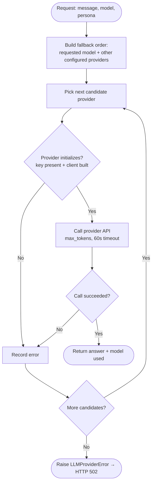
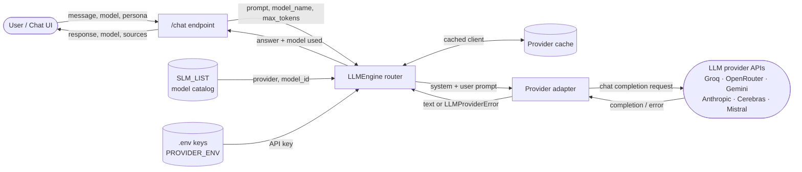

# API Integration — Report

_AI in Finance · `backend/services/llm_service.py`, `backend/services/api_providers.py`, `config/slm_config.py`_

## 1. Overview

API integration is the layer that turns a chat request into an answer from a
Large Language Model. A single router — **`LLMEngine`** — takes the user's
selected model, dispatches the call to the right provider's API, and, if that
provider fails, **transparently falls back to another configured provider**.
This pools several independent free-tier accounts into one resilient service.

Key properties:
- **Multi-provider** — six models across six providers behind one interface.
- **Fallback router** — a free-tier rate-limit or outage rolls to the next
  usable provider instead of failing.
- **Concurrency-safe** — the model is resolved per call, with no shared mutable
  state, so simultaneous requests can't clobber each other's routing.
- **Fails loudly** — a genuine upstream failure surfaces as an HTTP error, never
  as a fake "answer".

## 2. Components

| Component | File | Role |
|---|---|---|
| `LLMEngine` (router) | `llm_service.py` | Resolves the model, builds the fallback chain, dispatches, caches providers |
| Provider adapters | `api_providers.py` | One class per provider; each wraps that vendor's SDK/endpoint and normalizes errors to `LLMProviderError` |
| `SLM_LIST` | `config/slm_config.py` | The model catalog (name → provider + model id); entry 0 is the default |
| `PROVIDER_ENV` | `llm_service.py` | Maps each provider to its API-key env var (used to skip unconfigured providers) |
| `/chat` endpoint | `main.py` | Entry point; calls the router and shapes the response |

**Providers:** Groq, OpenRouter, Google Gemini, Anthropic (each via its SDK),
plus Cerebras and Mistral (OpenAI-compatible, sharing one base adapter). All cap
`max_tokens` (800 for plain chat; 1024 for web/research/blend answers) and use a
**60-second per-call timeout**.

## 3. The model pool

| Model | Provider | Status |
|---|---|---|
| Llama 3.1 8B Instant _(default)_ | Groq | ✅ live |
| GPT-5.5 | OpenRouter | ✅ live |
| Gemini 3 Flash | Google | ✅ live |
| Mistral Small | Mistral | ✅ live |
| Claude 3 Haiku | Anthropic | ⚠️ needs account credit |
| GPT-OSS 120B | Cerebras | ⚠️ needs account credit |

The two gated models are billing issues, not code — the fallback router routes
around them automatically.

## 4. Request lifecycle (the fallback router)

1. **Resolve the fallback order** — the requested model first, then every *other*
   provider whose API key is set (`PROVIDER_ENV`), in catalog order. Providers
   with no key are skipped so no attempt is wasted.
2. **For each candidate, in order:**
   a. **Initialize the provider** (build/reuse a cached client). If it can't be
      built (missing key / unknown provider), record the error and try the next.
   b. **Call the provider's API** with the prompt, persona, `max_tokens`, and a
      60 s timeout.
   c. **Success →** return `(answer, model_actually_used)`. If a fallback
      answered, that model name is what the UI reports.
   d. **Failure →** record the error (rate-limit, bad key, timeout, outage) and
      move to the next candidate.
3. **If every candidate fails**, raise `LLMProviderError` → the endpoint returns
   **HTTP 502** so the UI shows a real error, not a fabricated answer.

## 5. Resilience & safety features

| Feature | How |
|---|---|
| Provider fallback | Requested model → other configured providers → aggregated error only if all fail |
| Concurrency safety | Model resolved per call; no shared `current_model_name` on the request path |
| Fail-fast | `ensure_any_provider` checks the whole chain before a paid web-search call |
| Timeouts | 60 s per provider call, so a hung upstream can't block a worker |
| Errors as errors | Providers raise `LLMProviderError`; `/chat` maps it to HTTP 502 |
| Provider cache | Clients cached by provider+model to avoid re-initializing heavy SDKs |
| Configurable output | `max_tokens` parameterized (800 plain chat, 1024 for web/research) |
| Transparent fallback | Response reports the model that actually answered |

## 6. Activity diagram

A step-by-step view of a single request through the router (see
`api_integration_activity_diagram.png`).

## 7. Data flow diagram

How data moves between the user, the router, the config/keys, and the provider
APIs (see `api_integration_dataflow_diagram.png`).

## 8. Status & limitations

- **Live:** 4 of 6 models answer directly (Groq, OpenRouter, Gemini, Mistral);
  Anthropic and Cerebras need account credit and are covered by fallback.
- **Streaming:** plain chat streams token-by-token via `POST /chat/stream`;
  web/RAG/blend answers stay on the JSON `/chat` path because they need
  citation/source post-processing. Fallback still applies before the first token.
- **Not implemented (by design, for now):** token/cost usage metering;
  rate-limit-aware *predictive* routing (the current fallback is reactive — it
  retries after a failure rather than tracking per-provider quota).
- Verified end-to-end: all six models tested via `/chat`, fallback confirmed
  live (a failing provider transparently rolled to a working one), and unknown
  model names degrade gracefully to the default.
