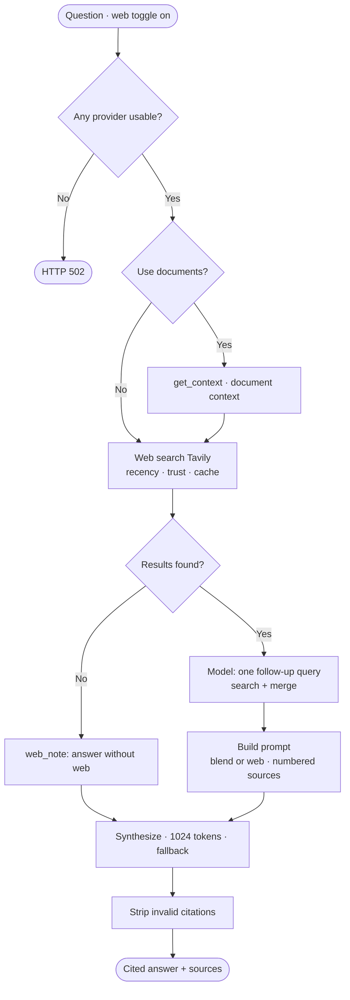
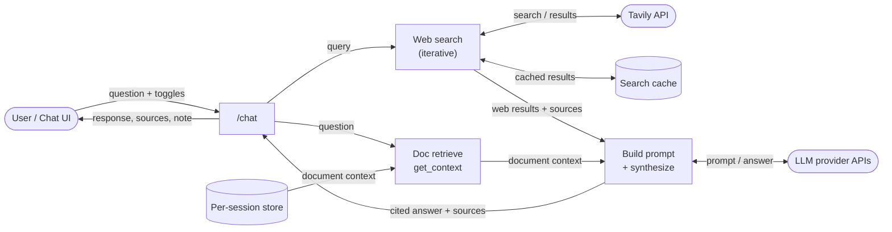

# Deep Research Integration in Q&A — Report

_AI in Finance · `backend/services/research_service.py`, `backend/main.py` (`/chat`), `ui/chat.py`_

## 1. Overview

"Deep Research" adds **live web search inside the chat**. When the user ticks
**"🌐 Search the web"**, the assistant searches the web for current sources,
writes an answer with **inline `[1] [2]` citations**, and lists the **sources it
used** beneath the reply. Turned on *together* with the document option, it
**blends the user's uploaded documents with live web results** into one cited
answer (e.g. "compare my statement to current rates").

It is **opt-in** (off by default, so normal chat is unaffected), powered by
**Tavily** for search and the selected chat model for synthesis, and it
**degrades gracefully** — if search is unavailable it still answers, with a note.

## 2. Components

| Component | File | Role |
|---|---|---|
| Web search | `research_service.py` | `iterative_web_search` / `web_search` query Tavily; recency, domain-trust, and a query cache |
| Prompt building | `research_service.py` | `build_web_prompt` / `build_blend_prompt` — citation-numbered context + a sources list |
| Citation safety | `research_service.py` | `strip_invalid_citations` removes `[n]` markers with no matching source |
| Chat API | `main.py` → `POST /chat` | Async endpoint; orchestrates search + document retrieval + synthesis |
| Document context | `rag_service.py` | `get_context` supplies uploaded-document context for the blend |
| Synthesis | `llm_service.py` | Selected model writes the cited answer (with provider fallback) |
| UI | `ui/chat.py` | "Search the web" toggle; sources panel; blend when both toggles on |

## 3. Modes

| Toggles | Mode | Behaviour |
|---|---|---|
| none | chat | Plain model answer |
| web | web | Web search → cited answer + sources |
| documents | rag | Answer grounded in uploaded documents (`/rag/ask`) |
| web + documents | **blend** | One cited answer combining documents **and** the web |

## 4. Request lifecycle (web / blend)

1. **Fail-fast** — `ensure_any_provider` checks the whole provider chain; if no
   model is usable it returns `502` *before* spending a paid web search.
2. **Document context** (blend only) — `get_context` retrieves the session's
   relevant document text (no synthesis yet).
3. **Iterative web search** — `web_search(query)` hits Tavily, then the model is
   asked for **one** follow-up query to fill gaps; that is searched too and the
   results are merged/deduped/re-ranked (bounded to two searches). Along the way:
   **recency** filtering for time-sensitive queries, a **domain-trust** boost for
   authoritative sources, and a short-lived **cache** to save credits.
4. **Build the prompt** — `build_blend_prompt` (documents + web) or
   `build_web_prompt` (web only): a citation-numbered context block plus the
   parallel sources list for the UI.
5. **Synthesize** — the selected model answers with inline `[n]` citations, at a
   larger token budget (1024) than a plain chat reply, with provider fallback.
6. **Sanitize & return** — `strip_invalid_citations` drops any dangling `[n]`;
   the response returns `{response, model, sources, web_note}`.

If search is unavailable at any point (no key / error / no results), `web_note`
explains it and the assistant answers **without** web sources rather than failing.

## 5. Features

| Feature | How |
|---|---|
| Web + document blend | Retrieve document context + web results → one cited answer |
| Iterative search | Query → one model-generated follow-up → merge (max 2 searches) |
| Recency filtering | Time-sensitive queries restricted to recent Tavily news (`topic=news`, `days=30`) |
| Domain trust | Authoritative finance/gov domains get a ranking boost |
| Search cache | Identical recent queries served from a 10-min in-memory cache |
| Citation safety | Out-of-range `[n]` markers stripped from the answer |
| Higher token budget | Web/blend answers get 1024 tokens (vs 512 plain) |
| Graceful degradation | Web unavailable → answers anyway, with a transparent note |

## 6. Activity diagram

A single Deep Research query, step by step (see
`deep_research_activity_diagram.png`).

## 7. Data flow diagram

How data moves between the user, the chat endpoint, search, documents, and the
model (see `deep_research_dataflow_diagram.png`).

## 8. Status & limitations

- **Verified live:** web search returns finance-authoritative sources; recency
  surfaces current figures; the cache makes repeats faster; and the blend
  combined an uploaded document's revenue with live web data in one cited answer.
- **Why Tavily, not Groq's built-in search:** Groq's compound/agentic models
  returned `413` on the free tier, so search uses Tavily and a regular model
  writes the answer.
- **Limitations:** single follow-up (not an unbounded agent); chat-length answers
  (1024-token budget, not long-form reports); domain trust boosts but does not
  hard-filter sources; a runtime provider auth/quota error still spends the search
  credit before the fallback answers.
