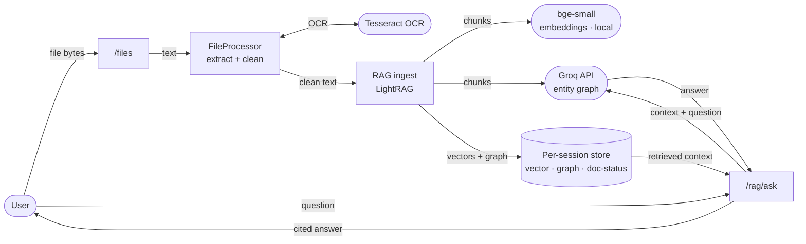

# Document Processing with RAG — Report

_AI in Finance · `file_processor.py`, `rag/rag_service.py`, `rag/embedding_adapter.py`, `/files` + `/rag/ask`_

## 1. Overview

This is the pipeline that turns an uploaded file into something the assistant
can **answer questions about**. A document is extracted to clean text, cleaned
and split on its own structure, embedded, turned into a knowledge graph, and
stored per session — so later questions are answered **grounded in that
document, with a citation**, instead of from the model's general knowledge.

The recent improvements target **retrieval quality for financial documents** —
where the numbers in tables are the most valuable content — and the **free-tier
budget** that indexing consumes.

## 2. Components

| Component | Role |
|---|---|
| `/files` endpoint | Receives the upload; enforces the 25 MB cap; runs extraction off the event loop |
| `FileProcessor` | Extracts text from every format; preserves tables; OCR for scans/images |
| `RAGService` (LightRAG) | Chunks, embeds, builds the entity/relationship graph, stores per session |
| Embedding model | `bge-small-en-v1.5` (local, CPU), 384-dim |
| Groq LLM | Entity/relationship extraction during indexing; answer synthesis at query time |
| `/rag/ask` | Retrieves from the session's store and returns a cited answer |

## 3. Supported inputs

PDF, DOCX, PPTX, XLSX/XLS, CSV, TXT, and images (PNG/JPG/… via OCR). Tables are
preserved as pipe-delimited rows across every format so financial figures keep
their row/column structure.

## 4. Pipeline stages

1. **Ingress** — the file is read with a 25 MB bound (oversized → `413`), and
   extraction runs in a threadpool so a big/scanned PDF doesn't block other
   requests.
2. **Type detection** — the parser is chosen from the file's content signature
   (magic bytes), so a mislabeled upload still parses correctly.
3. **Extraction** — format-specific; tables kept structured; scanned PDFs and
   images fall back to OCR; encrypted PDFs return a clear message.
4. **Clean** — repeated headers/footers are stripped; total text is capped at
   200k chars; a genuinely unreadable file is flagged and **not indexed**.
5. **Structure-aware chunking** — a split marker is inserted before each
   page/table/sheet boundary so LightRAG chunks on structure, keeping a table
   whole in one chunk.
6. **Embed + graph** — each chunk is embedded with bge-small and passed to Groq
   for entity/relationship extraction into the knowledge graph.
7. **Store** — vector store + knowledge graph + doc-status, isolated per session.
8. **Retrieve** — `/rag/ask` runs a hybrid (`mix`) query and Groq synthesizes a
   cited answer; `get_context` returns raw context for the web+document blend.

## 5. The improvements (this upgrade)

| Improvement | Effect |
|---|---|
| **Structure-aware chunking** | Chunks align to page/table/sheet boundaries — a balance sheet isn't split mid-table, so its numbers retrieve together |
| **Provenance in chunks** | The structural marker rides into the chunk, so page/table context is available to cite |
| **Finance-aware embeddings** | `bge-small-en-v1.5` (retrieval-tuned) replaces general-purpose MiniLM; same 384-d, better recall on numbers/jargon |
| **Boilerplate stripping** | Running headers/footers dropped → fewer noise chunks and **fewer Groq indexing calls** (saves quota) |
| **`get_context`** | Retrieves document context without synthesis, feeding the web+document blend |

Earlier extraction hardening also applies: PDF table de-duplication, DOCX
headers/footers/nested-tables/text-boxes, `.xls` support, encoding fallback,
image OCR, size cap, content-type detection, and encrypted-PDF handling.

## 6. Activity diagram

Processing one document and answering over it (see
`document_processing_rag_activity_diagram.png`).

```mermaid
flowchart TD
    A([Document uploaded]) --> B[Read ≤ 25 MB · detect type by content]
    B --> C[Extract text · preserve tables · OCR fallback]
    C --> D{Extraction sufficient?}
    D -- No --> W([Warn · not indexed])
    D -- Yes --> E[Strip boilerplate · cap 200k]
    E --> F[Segment on page/table/sheet markers]
    F --> G[Chunk · structure-aware]
    G --> H[Embed with bge-small]
    G --> I[Extract entities/graph · Groq]
    H --> J[(Per-session store)]
    I --> J
    J --> K{Indexed OK?}
    K -- No --> R([Report error · retry via /rag/reprocess])
    K -- Yes --> S([Document searchable])
    S --> Q[/rag/ask · hybrid mix query]
    Q --> T([Cited grounded answer])
```

## 7. Data flow diagram

How data moves from an uploaded file to a grounded answer (see
`document_processing_rag_dataflow_diagram.png`).



## 8. Verification & status

Verified end-to-end in Docker: a two-sheet finance workbook uploaded via `/files`
was extracted, structure-chunked, embedded with bge-small, and indexed; `/rag/ask`
then returned the correct net profit (300) and total assets (5000) with a
citation and **no chunking fallback**. Live regression confirmed all formats
(PDF/DOCX/PPTX/XLSX/XLS/CSV/TXT/image), the size cap, content-type detection,
encrypted-PDF handling, and boilerplate stripping.

**Deploy note:** the embedding-model change is not comparable with vectors indexed
under the old model — clear `rag_storage/sessions` once and restart so sessions
re-index under bge-small.
