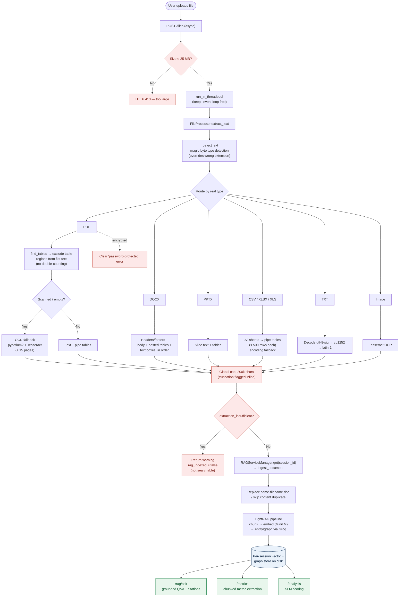

# Document Processing — Functionality Report

_AI in Finance · `backend/services/file_processor.py`, `backend/services/metric_extractor.py`, `/files` endpoint_

## 1. Overview

Document processing turns an uploaded file into clean, structured text that the
rest of the system can reason over. It is the front door to three downstream
capabilities: **document Q&A (RAG)**, **financial-metric extraction**, and
**SLM document analysis**.

The design goal throughout is **fidelity for financial documents** — the numbers
in balance sheets, income statements, and bank statements are the most valuable
content, so tables are preserved structurally rather than flattened, and the
pipeline is hardened against the messy, mislabeled, oversized, and scanned files
that real users upload.

## 2. Supported formats

| Format | Extensions | Extractor | Notes |
|---|---|---|---|
| PDF | `.pdf` | `pdfplumber` | Text + structured tables; OCR fallback for scans; encrypted-PDF detection |
| Word | `.docx` | `python-docx` | Body, **headers/footers**, **text boxes**, **nested tables** |
| PowerPoint | `.pptx` | `python-pptx` | Slide text + tables |
| Excel | `.xlsx`, `.xls` | `pandas` (+`openpyxl`/`xlrd`) | All sheets, row-capped |
| CSV | `.csv` | `csv` module | Quoted fields, encoding fallback, row-capped |
| Text | `.txt` | direct decode | Encoding fallback |
| Images | `.png`, `.jpg`, `.jpeg`, `.tiff`, `.bmp`, `.webp`, `.gif` | `pytesseract`+`Pillow` | OCR of a photo/scan of a statement |

## 3. Data architecture

## 4. Pipeline stages

### 4.1 Ingress — `POST /files`
- **Async endpoint**, but extraction is CPU-bound (parsing/OCR), so it runs in a
  **threadpool** (`run_in_threadpool`) — a large or scanned PDF can't block the
  event loop and freeze chat/RAG for other users.
- **Size cap (25 MB)** enforced by a bounded read; oversized files get a clean
  `413` (there is no auth in front of the endpoint, so this guards memory).

### 4.2 Type detection — `_detect_ext`
Parser choice is driven by the file's **content signature (magic bytes)**, not
its extension. A PDF saved as `.txt`, an `.xlsx` renamed `.csv`, or a `.docx`
renamed `.pdf` is still read correctly; zip-based Office files are told apart by
inspecting their members (`word/`, `xl/`, `ppt/`). Extension is used only when
the bytes are ambiguous (plain text).

### 4.3 Extraction (per format)
- **Tables are preserved as pipe-delimited rows** (`| cell | cell |`) across every
  format, so row/column structure survives into the text — critical for finance.
- **PDF:** `find_tables()` locates tables once; the flat-text pass **excludes**
  those regions so table figures aren't counted twice, and each table is rendered
  structured. Page markers (`--- Page N ---`) give provenance. Encrypted PDFs are
  detected and surfaced as a clear message.
- **Scanned PDFs / images:** OCR fallback via Tesseract (PDF: ≤ 15 pages).
- **DOCX:** headers/footers, body paragraphs and tables in document order, tables
  **nested** in cells, and **text boxes** — content `doc.paragraphs` alone drops.
- **CSV / Excel:** capped at **500 rows** per table/sheet (with an inline note),
  and text is decoded with an **encoding fallback** (utf-8-sig → cp1252 → latin-1)
  so currency symbols (£, €) in exports aren't dropped.

### 4.4 Safeguards
- **Global 200k-char cap** across all formats — bounds RAG cost so a long report
  can't overwhelm the free Groq tier during indexing.
- **`extraction_insufficient`** — if a file yields no usable text (empty, or a
  scan with no OCR available), it is flagged and **not indexed**, with a warning
  to the user instead of a silent failure.

### 4.5 Indexing — RAG
Per-session isolation via `RAGServiceManager`. On ingest, a same-named document
**replaces** the prior version (restated reports), and identical content is
treated as an already-indexed duplicate. LightRAG then chunks, embeds
(`all-MiniLM-L6-v2`), and extracts an entity/relationship graph via Groq.

## 5. Downstream consumers

| Endpoint | Uses the extracted text to… |
|---|---|
| `/rag/ask` | Answer questions grounded in the session's documents, with source citations |
| `/metrics` | Pull explicitly-stated financial metrics (revenue, margins, balances…), scanning the **whole** document in chunks and merging/de-duping results |
| `/analysis` | Score the document on verification / validation / explainability / persona-fit |

## 6. Robustness summary

| Risk | Mitigation |
|---|---|
| Event loop blocked by heavy parse/OCR | Threadpool offload |
| Oversized upload → OOM | 25 MB bounded read → `413` |
| Mislabeled file | Magic-byte type detection |
| Encrypted PDF | Detected → clear message |
| Huge spreadsheet / long report → Groq overload | 500-row cap + 200k-char global cap |
| Non-UTF-8 finance exports | utf-8-sig → cp1252 → latin-1 fallback |
| PDF table numbers double-counted | Table regions excluded from flat text |
| Scanned PDF / image | Tesseract OCR fallback |
| Silent extraction failure | `extraction_insufficient` warning, not indexed |

## 7. Known limitations

- **OCR loses table structure** — a scanned/photographed table becomes flat text
  (image-table reconstruction is out of scope).
- **Metric extraction covers the first ~48k chars** (6 × 8k chunks) to stay within
  rate limits; longer documents are truncated with a note.
- **Merged spreadsheet cells** may repeat a value (python-docx/pandas behaviour).
- **Very large multi-user concurrency** is bounded by the free Groq tier's
  tokens-per-minute limit during indexing.

## 8. Deployment note

Image OCR and scanned-PDF OCR require the **Tesseract binary**, which is installed
in the Docker image (`tesseract-ocr`) but not on a bare local Windows host. Verified
end-to-end in Docker: a bank-statement image uploaded via `/files` was OCR'd,
indexed, answered over (`/rag/ask` returned the correct closing balance with a
citation), and reduced to structured metrics (`/metrics`).
