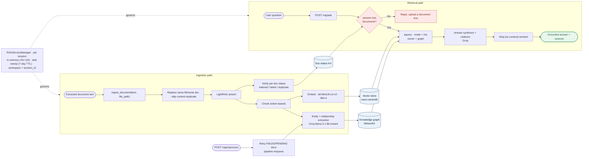

# LightRAG (RAG System) — Functionality Report

_AI in Finance · `backend/services/rag/` + `/rag/*` endpoints_

## 1. Overview

The RAG system lets a user **ask questions grounded in the documents they've
uploaded**, rather than in the model's general knowledge. It is built on
**LightRAG**, which combines classic vector retrieval with a **knowledge graph**
of entities and relationships extracted from the documents — so answers can draw
on both semantically-similar chunks *and* connected facts across a document.

Two design commitments shape everything:

1. **Per-session isolation** — each chat session has its own private knowledge
   base; one user's uploads are never visible to another's.
2. **Free-tier resilience** — the LLM work (entity extraction, answer synthesis)
   runs on Groq's free tier (6k tokens/min), so ingestion is deliberately
   serialized and failures are detected, reported, and retryable rather than
   silent.

## 2. Components

| Concern | Implementation | Detail |
|---|---|---|
| Orchestration | `LightRAG` (`lightrag-hku`) | Chunking, graph build, hybrid retrieval |
| LLM (extraction + synthesis) | Groq `llama-3.1-8b-instant` | `groq_adapter.py`, `temperature=0`, `max_tokens ≤ 512`, `max_retries=5` |
| Embeddings | `all-MiniLM-L6-v2` | `embedding_adapter.py`, **384-dim**, normalized, `max_token_size=512` |
| Vector store | nano-vectordb | LightRAG default, per-session file |
| Knowledge graph | NetworkX | Entities + relationships, per-session file |
| Doc-status store | KV JSON | Tracks each doc's indexing state |
| Session lifecycle | `RAGServiceManager` | In-memory LRU + on-disk TTL sweep |

## 3. Data architecture

## 4. Ingestion flow — `ingest_document(text, file_path)`

1. **Initialize** the session's LightRAG store lazily (first use only).
2. **Replace, don't duplicate** — any existing document with the same filename is
   deleted first, so a restated report *replaces* the old version instead of
   being dropped as a duplicate and serving stale data.
3. **Insert** (`ainsert`) — LightRAG chunks the text, embeds each chunk (MiniLM),
   and calls Groq to extract entities and relationships into the graph.
4. **Verify, don't assume** — the returned `track_id` is used to read each
   document's real status. The result distinguishes:
   - `indexed: true` — fully processed
   - `duplicate: true` — identical content already present (treated as success)
   - `replaced: N` — N old versions of this filename were replaced
   - `indexed: false` + `error` — genuine failure (e.g. rate-limit mid-extraction),
     surfaced to the user with a retry hint rather than silently swallowed.

## 5. Retrieval flow — `POST /rag/ask`

1. **Guard: does the session have documents?** Decided by reading the on-disk
   doc-status KV **without initializing** a store — so merely *asking* in an empty
   session doesn't create a persistent empty directory. If none: a friendly
   "upload a document first" reply.
2. **Hybrid query** (`aquery`, `mode="mix"`) — combines vector similarity with
   knowledge-graph traversal, the strongest LightRAG retrieval mode for questions
   that span multiple facts.
3. **Synthesis** — Groq composes the answer and cites its sources (the filenames /
   chunks it used).
4. **Sanitize** — LightRAG's internal `[no-context]` sentinel is replaced with a
   clean "couldn't find anything relevant" message so the raw marker never reaches
   the user.

## 6. Session management — `RAGServiceManager`

- **One `RAGService` per `session_id`**, each rooted at its own `workspace`. This
  is what actually enforces isolation: `working_dir` alone is insufficient because
  LightRAG binds storage to a process-wide in-memory dict keyed by `workspace`, so
  without a distinct workspace per session, sessions would leak into each other.
- **In-memory LRU (32 sessions)** — least-recently-used instances are finalized
  and dropped to bound memory; their on-disk data is preserved and transparently
  reloaded if the session returns.
- **Disk TTL sweep (7 days)** — on startup, session directories untouched for over
  a week are deleted so storage doesn't grow without bound.
- **`session_id` validation** — a strict regex guards against a malformed value
  being used to build a filesystem path.

## 7. Reliability features

| Concern | Handling |
|---|---|
| Silent ingestion failure | Per-doc status verified via `track_id`; failures reported, not swallowed |
| Stale data on re-upload | Same-filename doc deleted before insert (replace semantics) |
| Duplicate content | Detected and reported as an already-searchable success |
| Rate-limit mid-extraction | Groq SDK `max_retries=5`; failed docs stay retryable |
| Partially-indexed backlog | `POST /rag/reprocess` re-runs FAILED/PENDING docs via pipeline enqueue |
| Empty-session query | On-disk status check, no store init, friendly reply |
| `[no-context]` leakage | Sentinel replaced with a clean message |
| Cross-session leakage | `workspace = session_id` isolation |

## 8. Tuning / configuration

- `llm_model_max_async = 1`, `max_parallel_insert = 1` — extraction is serialized
  on purpose to stay under Groq's 6k tokens/min free-tier ceiling (defaults would
  burst several concurrent calls and trip 429s).
- Groq: `temperature=0` (deterministic extraction), `max_tokens ≤ 512`.
- Embeddings: normalized 384-d vectors (cosine similarity), `max_token_size=512`.

## 9. Known limitations

- **Free-tier throughput** — serialized ingestion means a large document can take
  a while to index; very large or many-document sessions can hit rate limits
  (mitigated by `/rag/reprocess`).
- **Reprocessed-doc citations** — a document recovered via reprocess may cite raw
  chunk text rather than a clean filename (cosmetic).
- **Concurrency** — retrieval quality and speed are bounded by the single-worker
  ingestion settings and the free Groq tier.
- **Answer quality** ties to the 8B model — good for grounded factual Q&A over the
  uploaded corpus, not a substitute for a larger model on open-ended reasoning.

## 10. Deployment note

RAG runs identically locally and in Docker; the Groq API key is the only external
dependency (`GROQ_API_KEY`). Embeddings run locally on CPU via
`sentence-transformers`. Per-session stores live under `rag_storage/sessions/`.
Verified end-to-end in Docker: an uploaded bank-statement image was OCR'd,
ingested, and answered over — `/rag/ask` returned the correct closing balance
with a citation to the source file.
