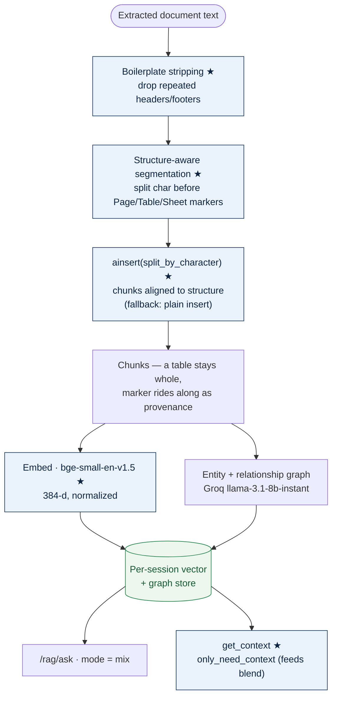
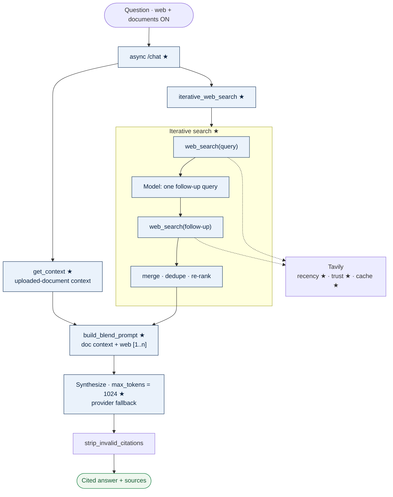

# RAG & Deep Research Upgrades — Report

_AI in Finance · two upgrade areas: Document processing → LightRAG, and Deep Research in Q&A_

## 1. Overview

Two upgrades that improve **how documents feed retrieval** and **how the
assistant researches an answer**. Both are grounded in the same constraint —
the free Groq tier (6k tokens/min) does entity-extraction for RAG *and*
synthesis for chat/web — so each change also aims to spend that budget well.

Commits: `5516083` (Area 2) and `0c6d139` (Area 3). Both are unit-tested and
verified end-to-end in Docker.

---

## 2. Area 2 — Document processing → LightRAG

The extraction layer was already comprehensive; these changes improve the
**quality of what gets indexed and retrieved**.

| Change | What it does | Why |
|---|---|---|
| **Structure-aware chunking** | Inserts a split character before each `--- Page N ---` / `[Table]` / `[Sheet:]` / text-box marker and passes it to `ainsert(split_by_character=…)`, so LightRAG chunks on document structure, not blind token counts | A balance sheet / income statement stays intact in one chunk instead of being split mid-table across two — the numbers that matter retrieve together |
| **Provenance in chunks** | The structural marker rides at the start of each chunk | The page/table context travels into the chunk, so the LLM can say "page 3, table" (partial of full citation-metadata; the rest needs a LightRAG fork) |
| **Finance-aware embeddings** | Swapped `all-MiniLM-L6-v2` → `BAAI/bge-small-en-v1.5` (same **384-d**) | A retrieval-tuned model recalls numeric/finance text better; same dimension means no vector-store schema break |
| **Boilerplate stripping** | Drops running headers/footers that repeat on >60% of a multi-page PDF's pages | Fewer noise chunks and **fewer Groq entity-extraction calls** during indexing (saves quota) |

### 2.1 Architecture

_★ = new in this upgrade._

---

## 3. Area 3 — Deep Research in Q&A

Single-pass web search became **deeper and blendable**.

| Change | What it does | Why |
|---|---|---|
| **Web + document blend** | With both toggles on, `/chat` retrieves the session's document context (`get_context`) and combines it with web results in **one cited answer** (`build_blend_prompt`) | Answers finance questions that need both — "compare my statement to current rates" |
| **Iterative (bounded agentic) search** | Runs the query, asks the model for **one** follow-up query to fill gaps, searches that, merges/dedupes/re-ranks | Catches facts the first query missed — bounded to two searches, no runaway loop |
| **Recency filtering** | Time-sensitive queries (rates, markets, news) restricted to recent Tavily news (`topic=news`, `days=30`) | Rate/market answers reflect the current picture, not a stale cached page |
| **Domain trust** | Authoritative finance/gov domains get a small ranking boost | Prefers Fed/SEC/Reuters/Bloomberg over blogs/forums when relevance is comparable |
| **Search cache** | Identical recent queries served from a short-lived in-memory cache | Saves Tavily credits on repeats |
| **Higher token cap** | `max_tokens` parameterized through every provider; web/blend answers get **1024** (vs 512) | Research answers need room |
| **Async `/chat`** _(bonus)_ | `/chat` is async; blocking web + LLM calls run in a threadpool | Blending (RAG retrieval + web) no longer stalls the event loop |

### 3.1 Architecture

_★ = new in this upgrade._

---

## 4. Verification (end-to-end, Docker)

- **RAG:** uploaded a two-sheet finance workbook; `/rag/ask` correctly returned
  net profit **300** (Income sheet) and total assets **5000** (Balance sheet)
  with a citation — and **no chunking-fallback warning**, confirming
  structure-aware chunking is active and bge-small is serving retrieval.
- **Blend:** asked "how does my document's revenue compare to current 2026 US
  inflation?" with both toggles on — the answer combined the document's
  **$1500 revenue** with **current 2026 inflation figures** from **6
  authoritative finance sources** (Citi, US Bank, USAFacts, Goldman…), citing
  web `[1]`/`[3]` and the uploaded document in one reply. Recency + trust +
  blend all confirmed live.
- **Plain chat:** unchanged (0 sources, normal answer) — the async rewrite
  didn't disturb the base path.

## 5. Deployment note

The embedding-model change is not backward-compatible with vectors indexed
under MiniLM (same dimension, different space). **On deploy, clear
`rag_storage/sessions` once and restart the backend** so sessions are
re-ingested under bge-small. New sessions need nothing.
